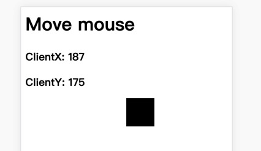
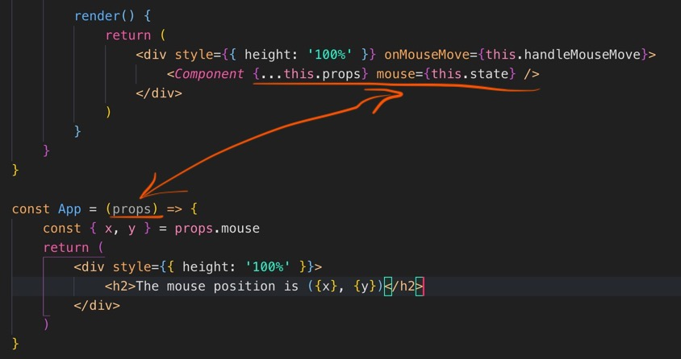
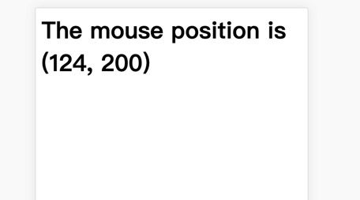

## Render Props 是一种在不重复代码的情况下共享组件间功能的方法。

### 1. 一般情况下组件的复用：

mouseTraker.js

```JavaScript
class MouseTracker extends React.Component {
    constructor(props) {
        super(props);
    }
    state = {
        x: 0,
        y: 0
    }

    handleMouse = (event) => {
        this.setState({
            x: event.clientX,
            y: event.clientY
        })
    }

    render() {
        return (
            <div style={{height: '100vh', width: '100vw'}} onMouseMove={this.handleMouse}>
                <h1>Move mouse</h1>
                <h3>ClientX: {this.state.x}</h3>
                <h3>ClientY: {this.state.y}</h3>
            </div>
        )
    }
}
```

cat.js

```JavaScript
import React from 'react'

class Cat extends React.Component {
    // constructor(props) {
    //     super(props)
    // }
    render() {
        const { x, y } = this.props
        return <div style={{ position: 'absolute', left: `${x}px`, top: `${y}px`, width: '50px', height: '50px', backgroundColor: '#000' }} />
    }
}

export default Cat
```

Cat 组件需要在组件中获得 x，y 来改变 div 的 position。在 MouseTracker 的 render 函数中调用 Cat 组件，将 MouseTracker 的 state 传入  
mouseTraker.js 修改：

```JavaScript
// mouseTraker.js

render() {
    return (
        <div style={{height: '100vh', width: '100vw'}} onMouseMove={this.handleMouse}>
            <h1>Move mouse</h1>
            <h3>ClientX: {this.state.x}</h3>
            <h3>ClientY: {this.state.y}</h3>
            <Cat {...this.state} />
        </div>
    )
}
```



### 2. 使用高阶组件（HOC）：

simpleHoc.js

```JavaScript
import React from 'react'
// import ReactDOM from 'react-dom'

// 高阶组件
const withMouse = (Component) => {
    return class extends React.Component {
        state = { x: 0, y: 0 }

        handleMouseMove = (event) => {
            this.setState({
                x: event.clientX,
                y: event.clientY
            })
        }

        render() {
            return (
                <div style={{ height: '100%' }} onMouseMove={this.handleMouseMove}>
                    <Component {...this.props} mouse={this.state} />
                </div>
            )
        }
    }
}

// 分割线

const App = (props) => {
    const { x, y } = props.mouse
    return (
        <div style={{ height: '100%' }}>
            <h2>The mouse position is ({x}, {y})</h2>
        </div>
    )
}

const AppWithMouse = withMouse(App)

export default AppWithMouse
```


效果如下：
  
<font color="#7CCD7C">HOC 最大的特点就是：接受一个组件作为参数，返回一个新的组件。</font>

同样 withMouse 中的 state 作为 props 传递给了 App 组件，从而在 App 组件中可以根据具体需要灵活地使用这个 state。
HOC 存在的问题：

- 当有多个 HOC 一同使用时，无法直接判断子组件的 props 是哪个 HOC 负责传递的。
- 重复命名的问题：若父子组件有同样名称的 props，或使用的多个 HOC 中存在相同名称的 props，则存在覆盖问题，而且 react 并不会报错。当然可以通过规范命名空间的方式避免。
- 在 react 开发者工具中观察 HOC 返回的结构，可以发现 HOC 产生了许多无用的组件，加深了组件层级。
- 同时，HOC 使用了静态构建，即当 AppWithMouse 被创建时，调用了一次 withMouse 中的静态构建。而在 render 中调用构建方法才是 react 所倡导的动态构建。与此同时，在 render 中构建可以更好的利用 react 的生命周期。

### 3. 使用 Render Props

<font color="#7CCD7C">Render Props 的核心思想是，通过一个函数将 class 组件的状态作为 props 传递给纯函数组件</font>

```JavaScript
// React中的render props
import React from 'react'
import PropTypes from 'prop-types'

class Mouse extends React.Component {
    static propTypes = {
        render: PropTypes.func.isRequired
    }

    state = { x: 0, y: 0 }

    handleMouseMove = (event) => {
        this.setState({
            x: event.clientX,
            y: event.clientY
        })
    }

    render() {
        return (
            <div style={{ height: '100%' }} onMouseMove={this.handleMouseMove}>
                {this.props.render(this.state)}
            </div>
        )
    }
}

const App = () => (
    <div style={{ height: '100%' }}>
        <Mouse render={(mouse) => (
            <h1>The mouse position is ({mouse.x}, {mouse.y})</h1>
        )} />
    </div>
)

// 或者：
const App = () => (
    <div style={{ height: '100%' }}>
        <Mouse>
            {(mouse) => (
                <h1>The mouse position is ({mouse.x}, {mouse.y})</h1>
            )}
        </Mouse>
    </div>
)
// 这种写法对应上面的this.props.render(this.state)就要改为this.props.children(this.state)

export default App
```

在 App 这个函数组件调用 Mouse 组件时，传了一个 render 方法（或者直接在标签的子元素内写方法），而在 Mouse 这个 class 组件内将自己的 state 作为该方法的参数，从而实现动态化渲染（render 方法名字可以自定义）。

<br/>
