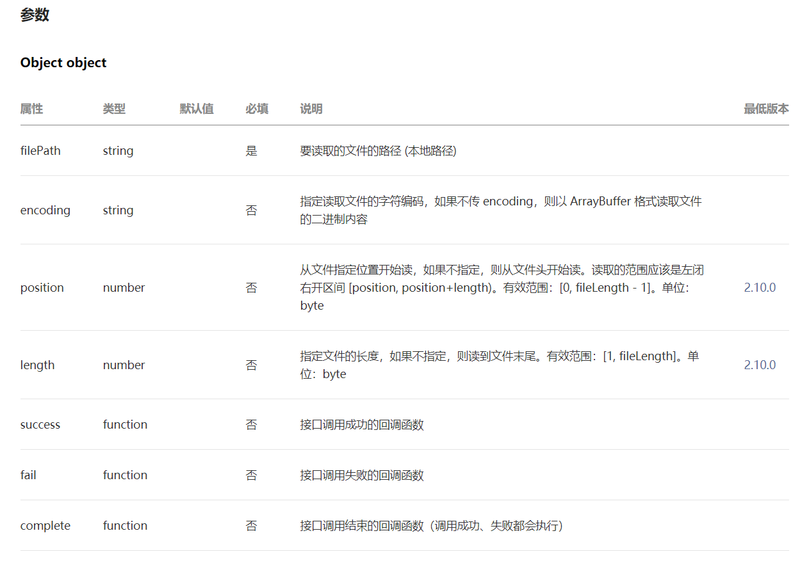
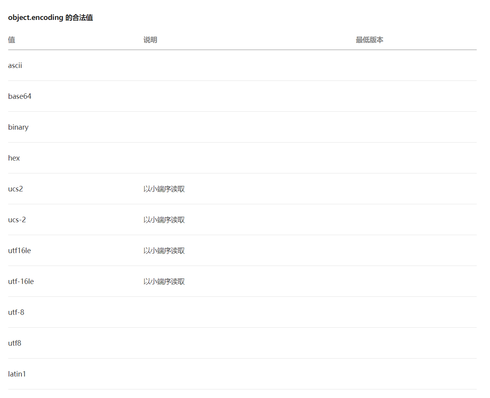

> 前言：原生小程序与现在的单页面应用开发框架上有些许的不同，还有微信做的许多限制，导致在开发过程中会遇到很多大大小小的问题，特此记录。`学而时习之，不亦乐乎`

<!-- more -->

## 在小程序中使用 npm 包

[微信官方文档-npm 支持](https://developers.weixin.qq.com/miniprogram/dev/devtools/npm.html)
看过官方文档其实也并不是很清楚，文档有以下 tips：

> tips: miniprogramRoot 字段不存在时，miniprogramRoot 就是 project.config.js 所在的目录

实际操作：和普通 npm 项目一样，在根目录下执行`npm init`生成了`package.json`,然后再装所需要的包，最后根据他第二步，一直往下执行。但在实际使用中，还是无法完全达到随心所欲的使用 npm 各种包，这一点要根据具体使用的什么包来对症下药，但使用中花费的力气有时还不如手写来的快了，这点是微信小程序比较坑的地方。

## 小程序长按识别二维码

小程序目前的版本（2021-06-05）只支持以下场景识别公众号（订阅号）二维码

- 公众号内长按识别结果：<font color="#B22222">可以</font>
- 小程序内长按识别结果：不可以
- 小程序内 webview(公众号文章)：<font color="#B22222">可以</font>
- 小程序内 webview(自定义 H5)：不可以
- 小程序客服消息长按识别：<font color="#B22222">可以</font>

所以要达到在小程序里长按图片识别公众号二维码的目的，实现方法只有使用`<webview>`内嵌公众号文章，在文章里放公众号的二维码。[具体实现方法](https://zhuanlan.zhihu.com/p/253214379)

## 小程序选择图片转 base64

这个在 web 编程中的方法可能多种多样，但是大部分都不适用于小程序，在尝试很多方法之后，发现小程序官方提供[wx.getFileSystemManager](https://developers.weixin.qq.com/miniprogram/dev/api/file/wx.getFileSystemManager.html)方法。

```JavaScript
wx.chooseImage({
  count: 1,
  success: (res) => {
    wx.getFileSystemManager().readFile({
      filePath: res.tempFilePaths[0],  // 选择图片返回的临时路径
      encoding: 'base64',  // 编码格式
      success: (res1) => {
        // 最终的base64
        let base64 = `data:image/png;bases64,${res1.data}`
        console.log(base64);
      }
    })
  }
})
```

> [FileSystemManager.readFile](https://developers.weixin.qq.com/miniprogram/dev/api/file/FileSystemManager.readFile.html)
> 读取本地文件内容





&nbsp;
