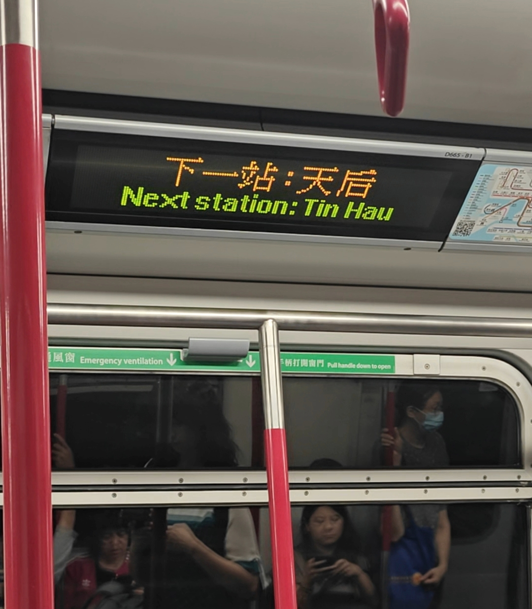

# 我仿似跟你熱戀過，和你未似這樣近

<b style="color:#df0f0f; font-size:18px;">”我们最接近的时候，我跟她之间的距离只有0.01公分，57个小时之后，我爱上了这座城市。“</b>

**&emsp;&emsp;從小就對香港這座城市非常的嚮往，無論是從小就看的電視上播放的TVB港劇，還是最愛聽的粵語歌，亦或是那個年代經典文藝港片，都在我心中埋下了港風的種子。今天終於來到了香港，仿似跟你熱戀過，和你未似這樣近。旅行的意義大概就是如此，當自己親身處於自己一直喜歡的文化當中，心裡充滿了激動和喜愛，久久不能褪去。**

## 重庆大厦

&emsp;&emsp;香港确实是一个非常适合citywalk的地方，行走在香港街头，似乎随手拿起相机记录下来都是很不错的街景。无处不在的红色的士，给这座城市增添了许多文艺气息，同时耳边不断萦绕的红绿灯倒计时，也让我感觉这行人的匆忙，生活节奏之快。

> 看过很多王家卫的文艺片，诸如《旺角卡门》，《重庆森林》。亲身来到这座城市，心中有种电影映射到了现实的满足感

王家卫电影《重庆森林》中的重庆大厦

## 下一站天后
> “在百德新街的爱侣，脸上有种顾盼自豪” ——《下一站天后》

当繁华星光褪去，心内最大理想，还是跟他归家为他唱

## 維多利亞港

在星光大道，眺望維港對岸

## 堅尼地城新海旁

## 中環

## 怪獸大廈

香港人口居住密度令人发指

## 皇后大道东

> 知己一聲拜拜遠去這都市，要靠偉大同志搞搞新意思 —— 《皇后大道東》

